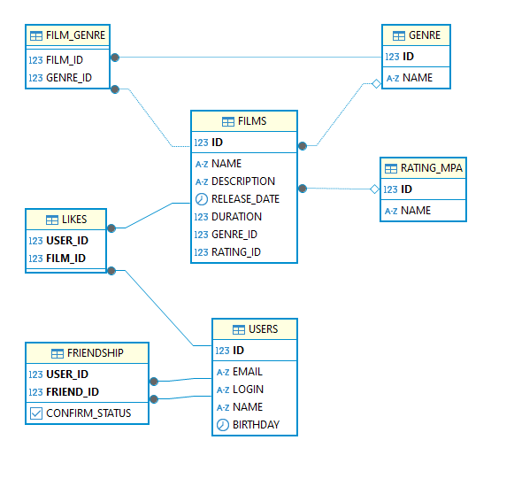

# java-filmorate
Template repository for Filmorate project.

## Диаграмма

На этой диаграмме отражена структура БД для проекта Filmorate.
Основные таблицы БД

- users информации о пользователях;
- films информация о фильмах;
- likes данные о лайках пользователей;
- friendship данные о дружбе между пользователями;
- genres жанры фильмов;
- rating-mpa рейтинги фильмов;
- film-genre данные о жанрах фильма.

## Пояснение архитектуры для коллег

Общая концепция проекта такова (и больше никакова)
1) Запрос приходит на контроллер и передается в сервис
2) Сервис принимает запрос, проверяет его, конвертирует маппером в экземпляр класса через ClassMapper.mapToClass() и отправляет этот экземпляр в хранилище
3) Хранилище передает экземпляр в репозиторий (DAL)
4) В репозитории уже идут запросы к БД, все как у вас в хранилищах и возвращаются коллекцииoptionalобновленные экземпляры классабулевы значения
5) В хранилище происходит проверка optional экземпляров, выбросы исключений и возврат непосредственно экземпляров (например Film film)
6) В сервисах, если есть возможность, экземпляры конвертируются в DTOшку через ClassMapper.mapToClassDto() и возвращаются в контроллер
7) Контроллер отдает DTO экземпляр

Да, DTO можно было не делать на данном этапе, но я предположил, что проект долгоиграющий и будут расширены поля классов. Поэтому они есть и хорошо будет 
